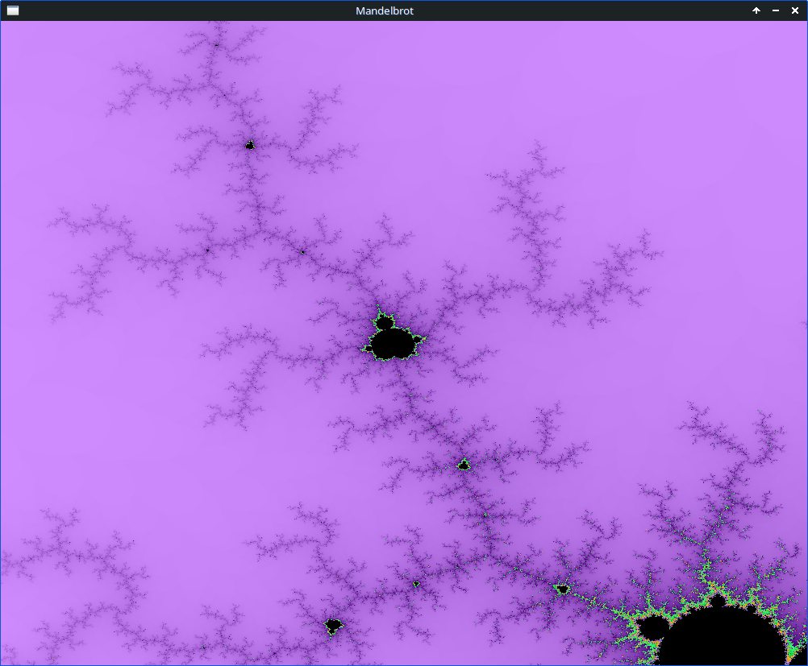
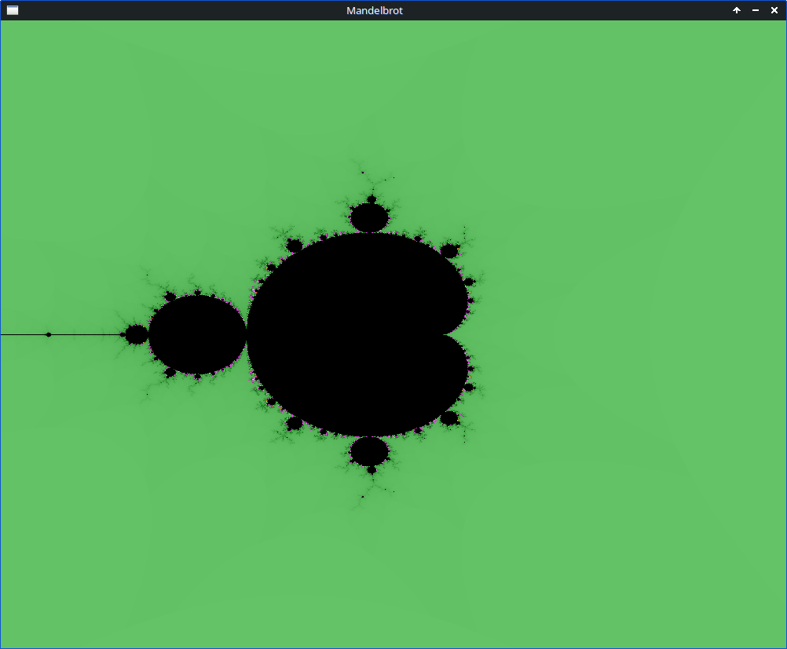

# mandelbrot
A C program that uses the mandelbrot set to display fractal art.

<br>




<br>

## Build the Program

Requirements:

>SDL2  
A C compiler  
make  

<br>

SDL2 is required to run the application.

First install SDL2.

For instance, on Debian / Ubuntu based distributions, run:

>```$ apt-get install -y libsdl2-dev```

<br>

Also make sure that the "make" program and a C compiler is installed.

On Debian / Ubuntu based distributions:

>```$ apt-get install -y gcc make```

<br>

If you are not using gcc, update the Makefile and replace "gcc" on the line "CC := gcc" with your compiler.

Then build the application by running the following command from within the project directory:

>```$ make```

<br>

## Run the Program

Run the program as follows:

>```$ ./mandelbrot```

<br>

## Controls

>LEFT CLICK - Zoom in at the clicked position.  
SPACEBAR   - Reset zoom.  
c          - Change color.  
ESC        - Quit the program.  
